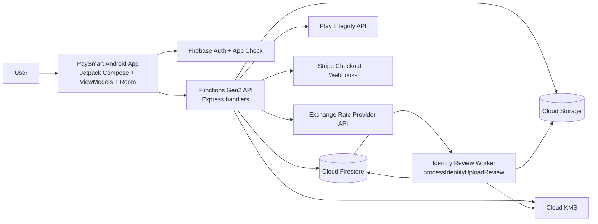
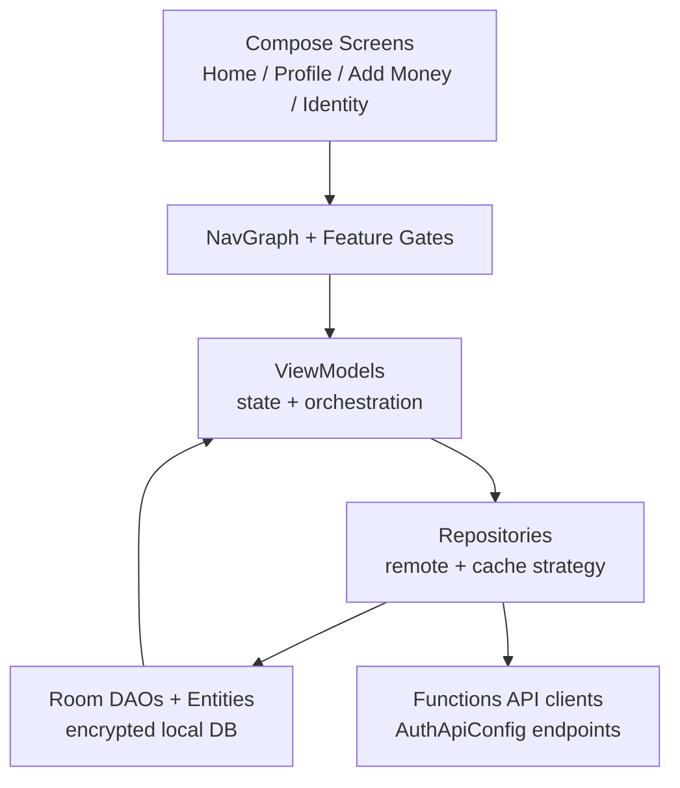
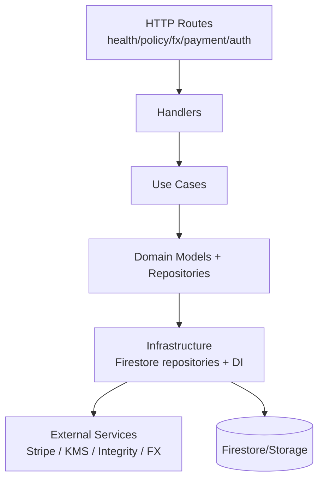
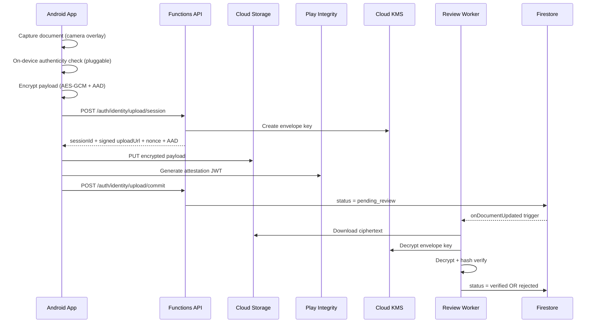
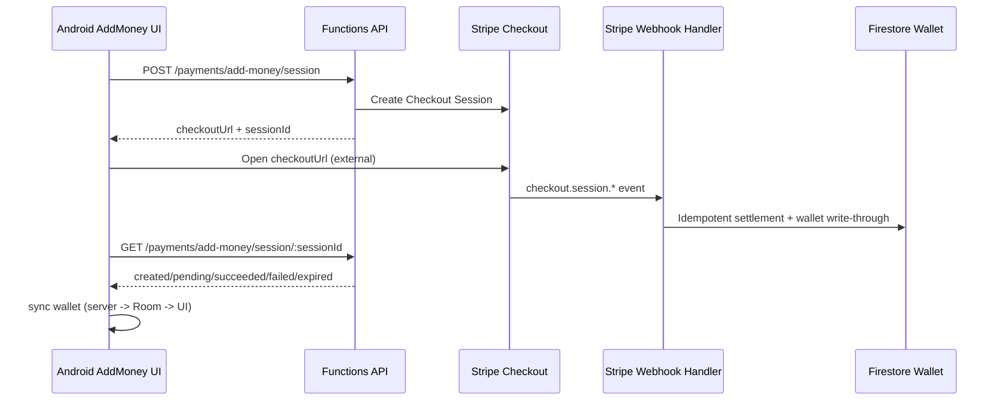
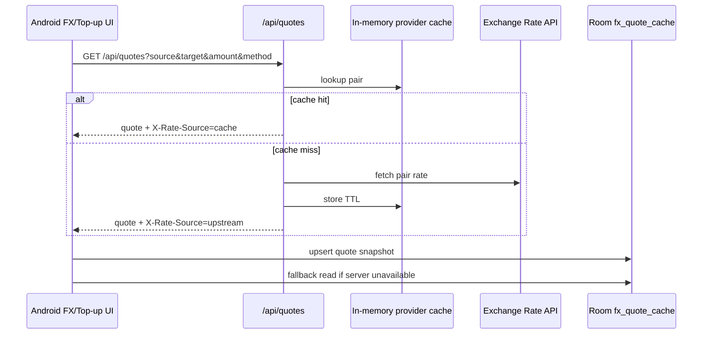

# PaySmart Architecture (Pitch View)

_Last updated: 2026-03-02_

## 1) One-page Summary
PaySmart is a mobile-first payments platform with a security-first core:
- Kotlin Android app using offline-first state (`server -> Room -> local UI`).
- Firebase Functions Gen2 API for policy, KYC, payments, and pricing.
- Secure identity verification pipeline (client-side encryption + attested commit + server-side review worker).
- Stripe sandbox-ready add-money rail with webhook settlement and wallet write-through.
- Live FX quote service with provider caching and fallback behavior.

## 2) System Context (End-to-End)

## 3) Android Runtime Architecture

### Current high-value app modules
- `ui/featuregate`: intent-based access gating + resume routes.
- `ui/profile/identity`: capture, encrypt, upload, attestation orchestration.
- `ui/home/addmoney`: Stripe session creation + status refresh.
- `ui/home/fx`: live quote models/repository and cache-backed quote state.
- `room/*`: local encrypted persistence and DAOs for wallet/profile/FX caches.

## 4) Backend Runtime Architecture (Functions)

### Implemented route families
- `payment.route.ts`: add-money session + status + Stripe webhook.
- `fx.route.ts`: quote endpoint (`/api/quotes`).
- `policy.route.ts` + auth handlers: onboarding/security/policy operations.
- identity handlers + worker: upload session/commit + async review transition.

## 5) Core Flow: Identity Verification (Compliance Path)

Why this matters for pitch:
- Sensitive IDs are not uploaded in plaintext.
- Verification is cryptographically bound to device/session context.
- State transitions are auditable (`pending_review -> verified/rejected`).

## 6) Core Flow: Add Money (Stripe Sandbox Rail)

## 7) Core Flow: Live FX Quotes

## 8) Trust Boundaries and Controls
- Client boundary:
  - App Check/Auth token required for sensitive API surfaces.
  - Identity payload encrypted before transport.
  - Offline hard-gate screen prevents partial/undefined client state when network is unavailable.
- API boundary:
  - Route-level validation and explicit status/error contracts.
  - Stripe webhook signature verification (or controlled unsigned mode in non-prod).
- Data boundary:
  - Firestore/Storage persistence with server-owned write paths for wallet settlement.
  - KMS-backed envelope key management for identity payloads.

## 9) Business Positioning Narrative (for pitch)
Use this architecture to tell a clear story:
1. **Trust-first payments foundation**: identity, attestation, and encrypted document pipeline.
2. **Monetizable rails active early**: add-money checkout with deterministic settlement.
3. **Cross-border readiness**: live FX quote layer and method-based fee model.
4. **Scale-ready product spine**: modular Kotlin + Functions architecture, offline-first UX, auditable backend transitions.

## 10) Observability and Cost Controls
- Firebase Analytics + Crashlytics for product/exception telemetry.
- Firebase Performance Monitoring integrated behind app-level wrapper:
  - release-only collection by default
  - local/debug collection disabled for noise/cost control
  - focused traces on critical network journeys (identity + add-money)
- Session lock diagnostics and route traces retained to verify lock lifecycle behavior.

## 11) Suggested Slide Mapping
- Slide 1: System context diagram + value proposition.
- Slide 2: Identity + compliance flow (why safer than naive upload).
- Slide 3: Add-money + FX monetization engine (unit economics + growth path).

---

If you want, I can generate a second version as a pure investor deck outline (`10-12 slides`) with speaker notes tied to this architecture.
